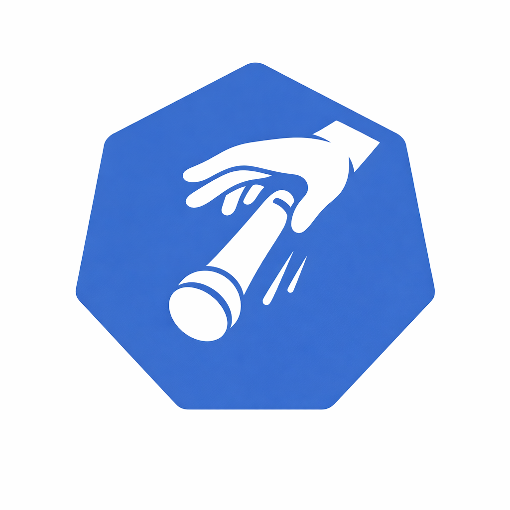

<p align="center">
  
</p>

<h1 align="center">Drop The Mic (DTM)</h1>

<p align="center">
  <strong>Kubernetes-native AI Verification Operator</strong><br/>
  Write checklist policies in plain language. LLM verifies your cluster. Get notified when things go wrong.
</p>

<p align="center">
  <a href="#quick-start">Quick Start</a> &bull;
  <a href="#how-it-works">How It Works</a> &bull;
  <a href="#installation">Installation</a> &bull;
  <a href="#configuration">Configuration</a> &bull;
  <a href="#contributing">Contributing</a>
</p>

---

## What is DTM?

DTM is a Kubernetes Operator that lets you define **cluster verification policies in natural language**. An LLM reads your policies, inspects the cluster using tool calls (pods, nodes, events, HPA, PDB, etc.), and reports results to Slack, GitHub Issues, or Jira.

No more brittle shell scripts or forgotten runbook items. Just describe what "healthy" means, and DTM continuously verifies it.

```yaml
apiVersion: dtm.dtm.io/v1alpha1
kind: ChecklistPolicy
metadata:
  name: production-health
spec:
  schedule:
    fullScan: "0 */6 * * *"        # Every 6 hours
    failedRescan: "*/30 * * * *"    # Retry failures every 30 min
  llm:
    provider: claude
    secretRef:
      name: dtm-llm-secret
  checks:
    - id: pod-restarts
      description: "Check if any pods in the production namespace have restarted more than 5 times in the last hour"
      severity: critical
    - id: hpa-saturation
      description: "Verify that no HPA is running at max replicas for more than 10 minutes"
      severity: warning
    - id: pdb-coverage
      description: "Ensure all Deployments with more than 1 replica have a PodDisruptionBudget"
      severity: warning
  notification:
    slack:
      channel: "#k8s-alerts"
      secretRef:
        name: dtm-slack-secret
```

## How It Works

```
┌─────────────────┐     ┌──────────────┐     ┌─────────────┐
│ ChecklistPolicy │────▶│   Operator   │────▶│     LLM     │
│   (Your rules)  │     │  Controller  │     │  (Claude /  │
└─────────────────┘     └──────┬───────┘     │ Gemini/GPT) │
                               │             └──────┬──────┘
                               │                    │
                        ┌──────▼───────┐     ┌──────▼──────┐
                        │  Dual-Loop   │     │  Tool Calls │
                        │  Scheduler   │     │ (read-only) │
                        └──────┬───────┘     └──────┬──────┘
                               │                    │
                        ┌──────▼───────┐     ┌──────▼──────┐
                        │   State      │     │ K8s API     │
                        │   Machine    │     │ (client-go) │
                        └──────┬───────┘     └─────────────┘
                               │
              ┌────────────────┼────────────────┐
              ▼                ▼                ▼
        ┌──────────┐   ┌────────────┐   ┌──────────┐
        │  Slack   │   │   GitHub   │   │   Jira   │
        └──────────┘   └────────────┘   └──────────┘
```

### Dual-Loop Scheduling

- **Full Scan** — runs all checks on a cron schedule
- **Failed Rescan** — retries only failed checks at a faster interval

When a rescan detects recovery, DTM sends a **resolved** notification automatically.

### Alert State Machine

```
UNKNOWN ──▶ FIRING ──▶ RESOLVED
               │
               └──▶ ESCALATED (after N consecutive failures)
```

Duplicate alerts are suppressed. Escalation happens after a configurable threshold of consecutive failures.

### Read-Only by Design

The LLM **never writes** to your cluster. All tool calls are strictly read-only — listing pods, reading events, checking HPA status, etc. DTM observes; it does not mutate.

## Quick Start

### Prerequisites

- Kubernetes cluster (v1.28+)
- Helm v3
- An LLM API key (Claude, Gemini, or OpenAI)

### Installation

```bash
# Add the Helm repo
helm repo add dtm https://drop-the-mic.github.io/charts
helm repo update

# Create the LLM API key secret
kubectl create secret generic dtm-llm-secret \
  --from-literal=api-key=<YOUR_API_KEY>

# Install DTM
helm install dtm dtm/drop-the-mic \
  --set operator.llm.provider=claude \
  --set operator.llm.secretRef=dtm-llm-secret
```

### From Source

```bash
git clone https://github.com/drop-the-mic/drop-the-mic.git
cd drop-the-mic

make generate      # Generate CRD types and deepcopy
make manifests     # Generate CRD YAML
make build         # Build operator + server binaries
make docker-build  # Build container image
make helm-package  # Package Helm chart
```

## Configuration

### Helm Values

```yaml
operator:
  image: ghcr.io/drop-the-mic/operator:latest
  llm:
    provider: claude          # claude | gemini | openai
    secretRef: dtm-llm-secret

ui:
  enabled: true
  service:
    type: ClusterIP
  ingress:
    enabled: false
    className: nginx
    host: dtm.example.com
```

### LLM Providers

| Provider | Model Examples | Tool Call Method |
|----------|---------------|-----------------|
| Claude | claude-sonnet-4-20250514 | `tool_use` blocks |
| Gemini | gemini-2.0-flash | `function_calling` |
| OpenAI | gpt-4o | `function_calling` |

### Available Tools

The LLM can call these read-only tools to inspect your cluster:

| Tool | Description |
|------|-------------|
| `list_pods` | List pods with status, restarts, resource usage |
| `list_nodes` | List nodes with conditions, capacity, allocatable |
| `get_events` | Retrieve Kubernetes events (warnings, errors) |
| `check_pdb` | Inspect PodDisruptionBudgets |
| `check_hpa` | Inspect HorizontalPodAutoscalers |
| `check_images` | Verify container image details |
| `get_logs` | Read container logs (tail) |

### Notification Channels

<details>
<summary><strong>Slack</strong></summary>

```yaml
notification:
  slack:
    channel: "#k8s-alerts"
    secretRef:
      name: dtm-slack-secret    # Secret containing webhook URL or bot token
```
</details>

<details>
<summary><strong>GitHub Issues</strong></summary>

```yaml
notification:
  github:
    owner: my-org
    repo: my-repo
    labels: ["dtm", "k8s-health"]
    secretRef:
      name: dtm-github-secret
```
</details>

<details>
<summary><strong>Jira</strong></summary>

```yaml
notification:
  jira:
    url: https://mycompany.atlassian.net
    project: OPS
    issueType: Bug
    secretRef:
      name: dtm-jira-secret
```
</details>

## Web UI

DTM ships with an optional web dashboard for managing policies and viewing results.

- **Dashboard** — overview of all policies with pass/fail/warn counts
- **Policies** — create and edit policies using a natural language editor
- **Results** — browse scan history with full LLM reasoning and tool call evidence
- **Settings** — configure notification channels and LLM settings
- **Run Now** — trigger an immediate scan from the UI

The UI is embedded in the server binary via `go:embed` — no separate deployment needed.

## CRDs

### ChecklistPolicy

User-authored resource defining what to check, when, and where to notify.

```bash
kubectl get checklistpolicies
NAME                PROVIDER   CHECKS   PASS   FAIL   LAST SCAN              AGE
production-health   claude     3        2      1      2026-03-24T12:00:00Z   7d
```

### ChecklistResult

Auto-generated by the operator after each scan. Contains verdicts, LLM reasoning, and raw tool call evidence.

```bash
kubectl get checklistresults -l dtm.dtm.io/policy=production-health --sort-by=.metadata.creationTimestamp
```

## Security

- **Read-only cluster access** — the operator never mutates workloads based on LLM output
- **Secret references** — API keys and tokens are stored in Kubernetes Secrets, never inline in CRDs
- **Separate RBAC** — the operator and UI server use distinct ServiceAccounts with minimal permissions
- **No kubectl exec** — all cluster interaction goes through `client-go`

## Development

```bash
make generate     # Generate deepcopy and CRD manifests
make manifests    # Generate CRD YAML
make lint         # Run golangci-lint
make test         # Run unit + integration tests
make ui-build     # Build React frontend (ui/dist)
make dev          # Deploy to local kind cluster
```

## Project Structure

```
drop-the-mic/
├── operator/          # Go Operator (core)
│   ├── api/           # CRD type definitions
│   ├── internal/
│   │   ├── controller/  # Reconcile loop
│   │   ├── scheduler/   # Dual-loop scheduler
│   │   ├── engine/      # Verification engine + LLM adapters + tools
│   │   ├── state/       # Alert state machine
│   │   └── notify/      # Slack, GitHub, Jira notifiers
│   └── config/          # CRD, RBAC, manager manifests
├── server/            # Go API server (UI backend)
├── ui/                # React + Vite + TypeScript frontend
└── charts/            # Helm chart
```

## Inspired By

- [k8sgpt](https://github.com/k8sgpt-ai/k8sgpt) — AI-powered Kubernetes troubleshooting
- [kubectl-ai](https://github.com/GoogleCloudPlatform/kubectl-ai) — Natural language Kubernetes commands

## License

Apache License 2.0 — see [LICENSE](LICENSE) for details.
